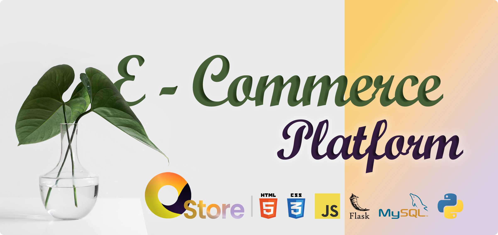

# E-Commerce Platform for 'C'
<p align="center">
    <picture>
      <source 
        srcset="./docs/assets/banner.png"
        media="(prefers-color-scheme: dark)"
      />
      
    </picture>
  </p>


This repository contains the database design and implementation for a single vendor e-commerce platform for C, a local chain retailer in Texas with a simple UI. The platform supports the following features:

* Product management: The platform allows users to create, manage, and track products, including their variants, categories, and inventory.
* Order management: The platform allows users to place orders, track their orders, and manage their payments.
* Reporting: The platform provides a variety of reports to track the performance of their e-commerce business.
* This Github Readme contains only the initial setup and deploy instructions of the project. For further info, refer the full documentation.

<p  align = "center">
    <a href="https://chathura-de-silva.github.io/E-Commerce-Platform/" target="_blank">
        
    </a>
</p>

# Getting Started

*   As prerequisites you should have,
    *    your mysql environment set up  and server running.
    *    Python environment with `Python version 3.11` or higher.

To get started with the platform, follow these steps : 
1.  Clone this repository.

    ```plaintext
    https://github.com/chathura-de-silva/E-Commerce-Platform
    ```
2.  cd in to the project directory and Install the dependencies using following command.(Activate the Virutal Environment if you are using one. It's recommended to use one.)

    ```plaintext
    $ pip install -r requirements.txt
    ```
<a name="env_setup"></a>

3.  create `.env` file inside the `dbInitialData` directory including following environmental variables.(You are supposed to update variable values according to your sql environment. You can simply copy the text below, modify it and save at the specified path as a `.env` file.)
    ```dotenv
    HOST=<hostname (defaults to "localhost")>
    USER=<MySql server username (defaults to "root")>
    PASSWORD=<your password (no defaults. You Must specify)>
    DATABASE=<Database name (deaults to "ecomdb")>
    ```

4.  You can entirely alter the initial database as per your requirements without involving in any coding (sql queries will be required only to specify the relations between tables and data types. Even it is a simple process of modifying some text files.). For more info refer the [Complete documentation](https://chathura-de-silva.github.io/E-Commerce-Platform/).

5.  Run the Project using following command.( `./app.py` is the main file.)
     ```plaintext
    $ python app.py
    ```
    *   This will initially create the database as you specified and will populate the data given. Thereafter it will run the app itself. If database already exists directly the app will run without reinitiating the database.


## About

This project was created as part of a 3<sup>rd</sup> semester university project under the Database Systems module in the Department of Computer Science and Engineering at the University of Moratuwa. Any contributions are welcome!

