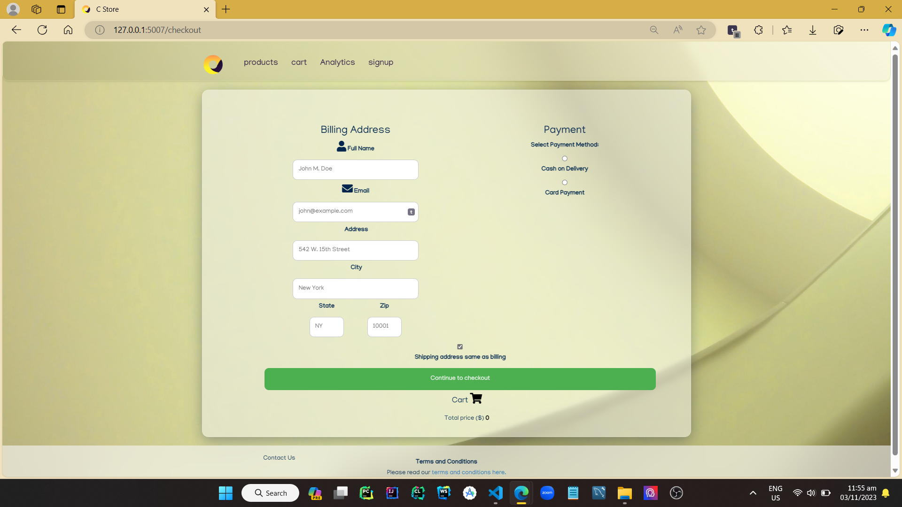
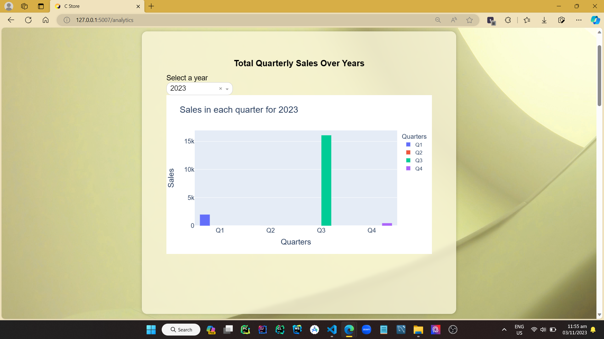
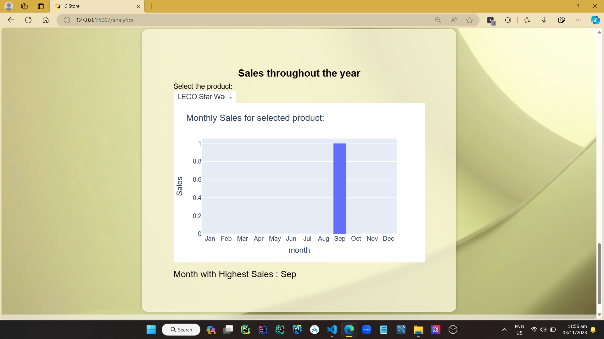

<h1 align = "center"> E-Commerce Platform for 'C' </h1>
<p align="center">
    <picture>
      <source 
        srcset="assets/banner.png"
        media="(prefers-color-scheme: dark)"
      />
      
    </picture>
  </p>


This repository contains the database design and implementation for a single vendor e-commerce platform for C, a local chain retailer in Texas with a simple UI. The platform supports the following features:

* Product management: The platform allows users to create, manage, and track products, including their variants, categories, and inventory.
* Order management: The platform allows users to place orders, track their orders, and manage their payments.
* Reporting: The platform provides a variety of reports to track the performance of their e-commerce business.


## Basic Implementation Details 
*   This project is using a SQL database to manage data. 
*   Backend is developed using Python with the `Flask` microframework.
*   This Project uses Server Side Rendering to render the user interface.
*   As per the requirements this project doesn't use an ORM anywhere and instead, always relies on vanilla SQL queries.
*   `Python version 3.11` or later recommended.
*   This project includes a python automation script which allows you to specify the initial database entirely by modifying some files without needing to write sql quries for everything.

# Installation Guide

## Getting started
*   As prerequisites you should have,
    *    your mysql environment set up  and server running.
    *    Python environment with `Python version 3.11` or higher.

To get started with the platform, follow these steps : 
1.  Clone this repository.
    ```bash
    https://github.com/chathura-de-silva/E-Commerce-Platform
    ```
2.  cd in to the project directory's root and Install the dependencies using following command.(Activate the Virutal Environment if you are using one. It's recommended to use one.)
    ```bash
    $ pip install -r requirements.txt
    ```
<a name="env_setup"></a>

3.  create `.env` file inside the `dbInitialData` directory including following environmental variables.(You are supposed to update variable values according to your sql environment. You can simply copy the text below, modify it and save at the specified path as a `.env` file.)
    ```dotenv
    HOST=<hostname (defaults to "localhost")>
    USER=<MySql server username (defaults to "root")>
    PASSWORD=<your password (no defaults. You Must specify)>
    DATABASE=<Database name (deaults to "ecomdb")>
    ```
4.  You can entirely alter the initial database as per your requirements without involving in any coding (sql queries will be required only to specify the relations between tables and data types. Even it is a simple process of modifying some text files.). For more info refer the [later part](#configuration-of-initial-database) of this document.

5.  Run the Project using following command in project root.( `./app.py` is the main file.)
     ```bash
    $ python app.py
    ```
    *   This will initially create the database as you specified and will populate the data given. Thereafter it will run the app itself. If database already exists directly the app will run without reinitiating the database.
## Configuration of Initial Database

### Overview
Everything you have to modify to create the initial database you wish to have is located inside `/dbInitialData/` directory.

* `database_relations.sql` holds 'ALTER' queries which creates the relations between tables of the database. 
* All the `.csv` files, each represents a table in the initial database.
* `.env` file (should be created by you as mentioned) contains environmental variables related to your MySQL environment.

### Tables
  Every `.csv` file will generate a separate table in the database.
  
  Table name will be the same as the csv file's name.
  * Ex - `product.csv` creates a table in the database called `product`. So you can create or rename the csv files as per your requirement.


> [!Important]
>* While altering the inital data as they wish according to the data constraints is recommended for any user, creating,renaming or deleting tables via creating,renaming or deleting the respective `.csv` files is only meant to be done by advanced users since the project depends on the current database schema despite being independant of the dummy data.

  You can either use something like Microsoft Excel or a plain text editor like Notepad for the purpose of creation and editing of CSV files.
  
**Make sure to use double quotes(`"`) as the quotechar and comma(`,`) as the delimiter. Otherwise the project will fail to initiate the database properly.**
* If you are editing csvs' in Excel make sure that the delimiter and quotechar is set as specified. If you are using a text editor, you have to explicitly use the quotechar and delimiter wherever required. Using Excel is the preffered way.

### Column Identifiers
In each coloumn name, only the first word should be the column identifier. There after you have to specify the Data type starting from the next word. 

**Do Not enter anything other than the "\<column_identifier\> \<data type\>".**

### Data Entries
Fill the CSV file with records in the regular way. But data have to be in accordance with the data type of the respective column.
 
### Sample Table - product.csv

#### Table view
| product_id INT | title VARCHAR(255) | description TEXT          | weight DECIMAL(10, 2) | category_id INT | product_image TEXT |
| -------------- | ------------------ | ------------------------- |---------------------- | --------------- | ------------------ |
| 101            | Samsung galaxy S21 | Samsung Galaxy S21, 128GB |0.35                   | 3               | /assets/s21u.jpeg  |
| 202            | Dennim Jeans       | Classic denim jeans       |0.6                    | 6               | /assets/jean.jpeg  | 
#### Text View
```csv
product_id INT,title VARCHAR(255),description TEXT,"weight DECIMAL(10,2)",category_id INT,product_image TEXT
101,Samsung galaxy S21,"Samsung Galaxy S21, 128GB",0.35,3,/assets/s21u.jpeg
202,Dennim Jeans,Classic denim jeans,0.6,6,/assets/jean.jpeg
```

### Table relations
You have to write `ALTER` SQL queries for the referencing inside `dbInitialData/database_relations.sql`.

Keep an empty line between each SQL query. 
You can add comments if you want to. But it is recommended to avoid comments.

Ex -     
  ```sql
    ALTER TABLE product
    ADD CONSTRAINT pk_product_id
    PRIMARY KEY (product_id);

    ALTER TABLE variant
    ADD CONSTRAINT pk_variant_id
    PRIMARY KEY (variant_id);
  ```
### Configuration of `.env` file.
*  Refer the [Getting Started](#getting-started) segment of this document.


# Developer Guide

## Entity-Relationship (ER) Diagram

<p align = "center">

</p> 

## Project Structure
* `./docs` only contain files related to the project documentation. These documents do not affect the functionality of the program.

* All the `.csv` files related to the initial database are included the .`./webapp/dbinitialData/`.

* All the relasionships among tables in the intial database are included in the `./webapp/dbinitialData/database_relations.sql`

* Static contains all the static assets used in the project as well as the image assets related to the dummy data. You can remove and add images to the respective directories accordingly if you wish to use them for storing your assets.

  * Static directory contains category-images,product-images,subcategory-images sub directories. Image files for related functionalities are included in these files separately.


* In the `./requirements.txt` file, all the python thirdparrty dependecies are specified with recommended versions. 

* `./webapp/templates`holds the HTML files used to render the UI for the intuitively named respective pages.

* Again the intial database is configured in this `./webapp/databaseConfig.py` file.

* `./webapp/dbaccess.py` file contains the functions to communicate with the database using sql queries. It encapsulates SQL queries from the Flask app. Every vanilla flask queries used in the Python files are either in this directory or in `./webapp/databaseconfig.py`

## Requirments

### Python Package Dependencies

These are essential thirdparty Python libraries and packages that your project relies on to operate successfully. 

- ansi2html
- blinker
- cachelib
- certifi
- charset-normalizer
- click
- colorama
- dash
- dash-core-components
- dash-html-components
- dash-table
- Flask
- Flask-Session
- idna
- importlib-metadata
- itsdangerous
- Jinja2
- MarkupSafe
- mysql-connector-python
- nest-asyncio
- numpy
- packaging
- pandas
- plotly
- protobuf
- python-dateutil
- python-dotenv
- pytz
- requests
- retrying
- six
- tenacity
- typing_extensions
- tzdata
- urllib3
- Werkzeug
- zipp

# Insight Into The Database

Our Project Database serves as the backbone of our operations, providing structured storage and efficient management of our data. This document delves into the intricate design of the database, detailing its various components including functions, procedures, transactions, triggers, views, and indexes. In addition, we emphasize the security measures we have incorporated to protect our valuable data.
## Database Design

### Consistency and Avoiding Redundancy:

#### Unique Constraints: 
 - Ensures unique data for specific columns, thereby preventing redundancy. For instance, username in the registered_user table has been made UNIQUE to prevent duplicate entries.

#### Primary Keys: 
- Each table has a primary key, ensuring a unique identifier for each row, which in turn maintains consistency.

#### Foreign Key Constraints: 
- Establishes a link between data in two tables, ensuring consistency across tables. 
    E.g: the Variant_id in the order_item table is a Foreign Key referring to the variant table. 

#### CASCADE Options: 
- In the event of an update or delete operation, the CASCADE option ensures that changes are consistently reflected across related tables. This prevents orphan records and maintains database integrity.

### Normalizations and Improvements:

#### First Normal Form (1NF):
- Each table has a primary key, and there are no repeating groups or arrays. All attributes have atomic values.
#### Second Normal Form (2NF):
- Tables like order_item has composite primary keys (Order_item_id with Order_id). This decomposition ensures that every non-prime attribute is fully functionally dependent on the primary key.

#### Third Normal Form (3NF):
- Transitive dependencies are removed. For instance, the category table has a Parent_Category_id that points back to the same table, creating a hierarchical structure. Thus, by using a self-referencing foreign key, we ensure that the table is in 3NF by eliminating possible transitive dependencies.

#### Modularity of Tables:
- The database is designed such that entities like registered users, orders, orders items, cart items, and attributes are in separate tables. This modular design makes the database scalable and easy to manage.

#### Hierarchical Data:
- The category table uses a self-referencing foreign key (Parent_Category_id) to establish a category hierarchy, allowing for nested categories in the e-commerce platform.


## Stored Procedures
### Procedures for product management

A set of procedures that can be used to manage products, users, and attributes.


### Procedure for adding users

```sql
PROCEDURE AddUser(
  IN p_email VARCHAR(255),
  IN p_password VARCHAR(255),
  IN p_username VARCHAR(255)
)
BEGIN
  INSERT INTO registered_user (email, password, username)
  VALUES (p_email, p_password, p_username);
END
```

### Procedure to get cart
```sql
PROCEDURE get_cart(IN user_id INT)
BEGIN
    SELECT
        ci.quantity AS quantity,
        v.name AS name,
        v.price AS price,
        v.variant_image AS variant_image,
        p.title AS title,
        v.variant_id AS variant_id
    FROM
        cart_item AS ci
    JOIN
        variant AS v ON ci.variant_id = v.variant_id
    JOIN
        product AS p ON v.product_id = p.product_id
    WHERE
        ci.user_id = user_id;
END
```

### Procedure to get catogories

```sql
PROCEDURE get_categories(IN parent_category_name VARCHAR(255))
BEGIN
    SELECT Category.category_name, Category.category_image, Category.category_id
    FROM Category
    WHERE Category.parent_category_id = (
        SELECT category_id FROM Category WHERE category_name = parent_category_name
    );
END
```

### Procedure to get guest cart

```sql
PROCEDURE get_guest_cart(IN variant_id INT)
BEGIN
    SELECT p.title, v.name, v.price, v.variant_image, v.variant_id
    FROM product AS p
    JOIN variant AS v ON p.product_id = v.product_id
    WHERE v.variant_id = variant_id;
END
```

There are more procedures have used. Above are only some examples.

## Transactions

 updating order items:

  - *Transaction Usage*: This procedure also starts a transaction at the beginning and commits it at the end. 

```python
def update_order_items(order_items, is_signedin, user_id):
  conn = get_mysql_connection()
  cursor = conn.cursor()
  # create a transaction
  # inventry should be updated
  # we should handle this separately for logged in users and guest users

  # for a guest user his session cart should be emptied and for a logged in user his cart_item table should be updated
  # cart table should be inserted with a new entry
  try:
      # Start a transaction
      cursor.execute("START TRANSACTION")

      if is_signedin:
          order_item_id, order_id, variant_id, quantity, price = order_items[0]

          # INSERT INTO order_item
          insert_query = "INSERT INTO order_item (order_item_id, order_id, variant_id, quantity, price) VALUES (%s, %s, %s, %s, %s)"
          cursor.execute(insert_query, (order_item_id, order_id, variant_id, quantity, price))

          # DELETE FROM cart_item
          delete_query = "DELETE FROM cart_item WHERE user_id = %s"
          cursor.execute(delete_query, (user_id,))

          # Reduce stock count in inventory
          update_query = "UPDATE inventory SET stock_count = stock_count - %s WHERE variant_id = %s"
          cursor.execute(update_query, (quantity, variant_id))

      # Commit the transaction
      cursor.execute("COMMIT")

  except Exception as e:
      # Handle any exceptions and possibly roll back the transaction
      cursor.execute("ROLLBACK")
      raise e
  finally:
      conn.close()
```


## Triggers

* A single trigger is being used for the purpose of managing the stock count within its constraints.


## Views

A view is used to create a temporary table to keep the selected data and access them whenever needed with maximum efficiency.

Here is an example used in analytics to create sales reports.

```python
def Quarterly_sales(year):
  conn = get_mysql_connection()
  cur = conn.cursor()

  cur.execute(f'''CREATE VIEW year{year}orderitem AS
                  select v.price*oi.quantity as total_price , t23.date , oi.order_id, oi.variant_id
                  from order_item as oi
                  join (SELECT * FROM orders WHERE YEAR(date) = {year}) AS t23 on oi.order_id = t23.order_id
                  join variant as v on v.variant_id = oi.variant_id''')
  conn.commit()
  cur.execute(f'''select sum(total_price) as q1_price
                  from year{year}orderitem
                  where month(date) in (1,2,3);''')
  q1 = cur.fetchone()[0]
  q1 = int(q1) if q1 is not None else 0

  cur.execute(f'''select sum(total_price) as q1_price
                  from year{year}orderitem
                  where month(date) in (4,5,6);''')
  q2 = cur.fetchone()[0]
  q2 = int(q2) if q2 is not None else 0

  cur.execute(f'''select sum(total_price) as q1_price
                  from year{year}orderitem
                  where month(date) in (7,8,9);''')
  q3 = cur.fetchone()[0]
  q3 = int(q3) if q3 is not None else 0

  cur.execute(f'''select sum(total_price) as q1_price
                  from year{year}orderitem
                  where month(date) in (10,11,12);''')
  q4 = cur.fetchone()[0]
  q4 = int(q4) if q4 is not None else 0

  cur.execute(f'DROP VIEW IF EXISTS year{year}orderitem;')
  conn.commit()

  q_sale = [q1, q2, q3, q4]
  conn.close()
  return q_sale
```

## Security

### *Password Encryption*:
   - *Hashing Process*: When a user sets or updates their password, it's transformed from plain-text into a cryptographic hash. We utilize the bcrypt algorithm, one of the most trusted methods in the industry. This ensures that the actual password is never stored directly in our database.

   When intializing the database, Logging to the side as a user, Regisitering a new user password encryption and hashing is udes using `werkzeug` library.  

  ```python
  def add_user(data):
  conn = get_mysql_connection()
  cur = conn.cursor()
  username = data["username"]
  # need to check if the username already exists
  cur.execute("SELECT * FROM registered_user WHERE username=%s", (username,))
  result = cur.fetchall()
  # if we already have a registered user from that username then we can't add another user
  if len(result) != 0:
      return False
  customer_id = gen_custID()
  tup = (customer_id, data["email"], data["password"], data["username"],)

  cur.execute("INSERT INTO registered_user (user_id,email, password, username) VALUES (%s, %s, %s, %s)", tup)

  conn.commit()
  conn.close()
  return True
  ```

### *Password Verification*:
   - When a user logs in, their given password is compared with the stored hash in our database.
   - The `check_password_hash` function is used for this verification. It checks if the hashed version of the given password matches the stored hash without ever converting the hash back to plain-text. This ensures a secure and efficient login process.

### *SQL Injection Prevention using Prepared Statements*

* SQL Injection is one of the most prevalent and dangerous web application vulnerabilities. It allows attackers to insert malicious SQL code into queries, which can then be executed by the database.

* In our e-commerce platform, we're proactive in guarding against SQL Injection attacks by utilizing prepared statements in our SQL queries. Here's how prepared statements offer enhanced security:

i. *Parameterized Queries*:
- In our SQL queries, we use placeholders (?) instead of directly inserting values into the SQL string. This ensures that the database always treats the inputs as data rather than executable code.

ii. *Sanitizing Data*:
- All the data is sanitized when initializing the database.

  ```python
  def row_sanitizer(csv_reader_row):
  for i in range(len(csv_reader_row)):
      try:  # Had to use a try catch block to check whether string contains a float.
          if csv_reader_row[i] == 'NULL':  # Adding support for NULL values in fields such as integers.
              continue
          float(csv_reader_row[i].replace(" ", ""))  # If the cell is a float (or an integer), it will not
          # raise an exception. Instead, will jump to the next for loop iteration
      except ValueError:
          csv_reader_row[i] = f'''"{csv_reader_row[i]}"'''
  return csv_reader_row
  ```


# User Guide 

## Getting Started

* Creating an Account: To get started with the e-commerce platform, user could create an account. Click on the `Sign Up` button on the homepage, and provide user's details, including user's name, email address, and a secure password.

* Logging In: If user already have an account, simply click on the `Log In` button. Enter user's registered email and password to access user's account.

* Guest mode is there. So user can browse and proceed to checkout even if he or she is not registered on the platform. But the functionality gets limited.

<p align = "center"><kbd>
</kbd>
</p> 

## Browsing and Shopping

* Exploring Products: Currently in the dummy data in the database there are only two main categories as given below. But you can always add as much as main categories you want. You may have to alter the `./webapp/templatesproducts.html` accordingly.

      
    - Electronic products 

    - Toy products

* Product Details: Click on a product to view its details. This includes the product's name, description, price, and any available variants. User can also see the relavant images of the product.

* Adding to Cart: When user has found an item user would like to purchase, user can click the `Add to Cart` button. User can specify the quantity and select variants, if applicable.

* Shopping Cart: To review user's selected items, click on the cart tab at the navigation bar. Here, user can make any necessary adjustments to user's order.

* Continue shopping : To go to the shopping page again after adding something to the cart, click on the `Continue shopping` button.

* go to Checkout: Once user is satisfied with user's selections, click `go to Checkout` to complete user's purchase.

* If the user is logged in all his cart items and basic info will be saved and refetched as intuitively expected.

## Checkout and Payment

* Delivery Information:First to procees the checkout user should fill the necessary delivery information, including user's shipping address.

* Payment: Select user's preferred payment method (e.g., cash on delivery, card payment). Enter user's payment details securely.
  * User may have to enter further payment details according the method of payment he/she selects.

* Continue to checkout : After filling the required info, user can `Continue to checkout.`

<p align = "center"><kbd>
</kbd>
</p> 

## Managing User's Account

* Logging Out: To log out of user's account, simply click the `Log Out` button. 

## Analytics

* Platform currently supports realtime generation of 4 types of performance analysis reports.  Currently these reports could be accessed by anyone. Functionality is available to configure and download them as well.

* Total Quarterly Sales Over the Years: This section provides information about our total sales for each quarter over the years. It gives  an overview of the sales performance.

<p align = "center"><kbd>
</kbd>
</p> 

* Product Sales Quantities: Here, the stakeholders can explore data related to product sales quantities. It helps to identify which products are the most popular among the customers.

<p align = "center"><kbd>
</kbd>
</p> 

* Trending Categories: Could be used to discover the product categories that are currently trending on the platform. This data can be helpful for making informed decisions for further stock purchases and to identify the trends in the target audiance.

<p align = "center"><kbd>
</kbd>
</p> 

* Sales Throughout the Year: To get an insight on how the sales performance was throughout the year. 

<p align = "center"><kbd>
</kbd>
</p> 

## Contacting Support

* Contact Us: If user encounter any issues or have questions about products or services, user can reach out to customer support team. Click on the `Contact Us` link to find the contact details which are to be specified by the admin.

* Terms and conditions : Click on the `Terms and Conditions` link to read about terms and conditions which is specified by the admin. 


That's it! Feel free to explore and shop on the e-commerce platform. 
If you got any doubts or issues about the project and you are not sure whether it's a bug or a loophole in the project, first use the `discussions` section in our github repository. Otherwise you may directly open an issue with a relavant label.

# About

This project was created as part of a 3<sup>rd</sup> semester university project under the Database Systems module in the Department of Computer Science and Engineering at the University of Moratuwa. Any contributions are welcome!

> [!Note]
> * As this project is developed for an Assesment, It is not meant to be used in any commercial applications since it doesn't meet all the nessecary requirements yet. Instead the main focus is in the educational aspect of a DBMS Project.
